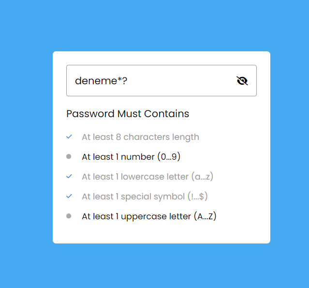

# Şifre Kontrol Uygulaması

Bu uygulama, kullanıcıların belirli şifre gereksinimlerini karşılayıp karşılamadığını kontrol etmek için kullanılır.

## Kullanım

1. "https://gayemce.github.io/passwordStrengthCheck/" linkini bir web tarayıcısında açın.
2. "Create Password" alanına bir şifre girin.
3. Şifrenin belirtilen gereksinimleri karşılayıp karşılamadığını kontrol edin.

## Gereksinimler

Uygulama, aşağıdaki şifre gereksinimlerini kontrol eder:

- En az 8 karakter uzunluğunda olmalıdır.
- En az bir sayı (0-9) içermelidir.
- En az bir küçük harf (a-z) içermelidir.
- En az bir özel karakter içermelidir (!...$).
- En az bir büyük harf (A-Z) içermelidir.

## Ek Bilgiler

- Uygulama, FontAwesome ikonları ve Poppins fontunu kullanmaktadır.
- `script.js` dosyası, şifre gereksinimlerini kontrol etmek için JavaScript kodunu içerir.
- `style.css` dosyası, uygulamanın görünümünü şekillendiren CSS stil dosyasını içerir.

## Katkıda Bulunma

- Uygulamayı çeşitlendirmek veya geliştirmek için bir çatal oluşturun.
- Değişiklikler yapın ve bir çekme isteği gönderin.
- Geri bildirimler ve katkılar için teşekkür ederiz!

## Proje Görsel

